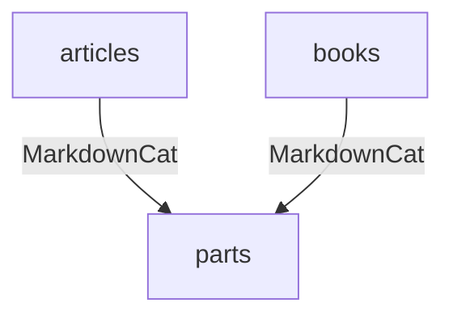
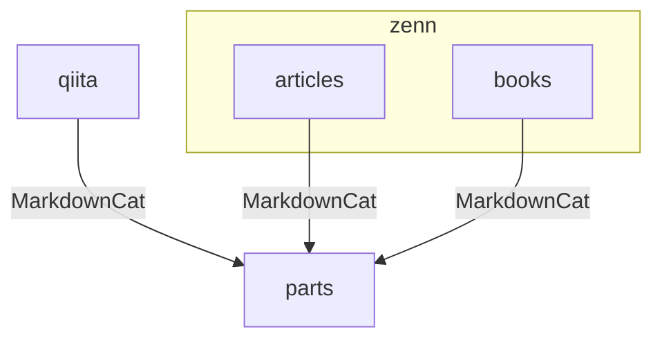

# Articles

## 拡張機能

### MarkdownCat

記事を再利用するために利用しています。

https://marketplace.visualstudio.com/items?itemName=poyonshot.markdowncat

## 依存関係

### 現状

### 理想像

## ライセンス

本リポジトリのライセンスは下記です。

- ソースコード： `MIT`
- 画像や文章などのコンテンツ： `CC BY 4.0`

> 詳細は [LICENSE](./LICENSE) を確認してください。
