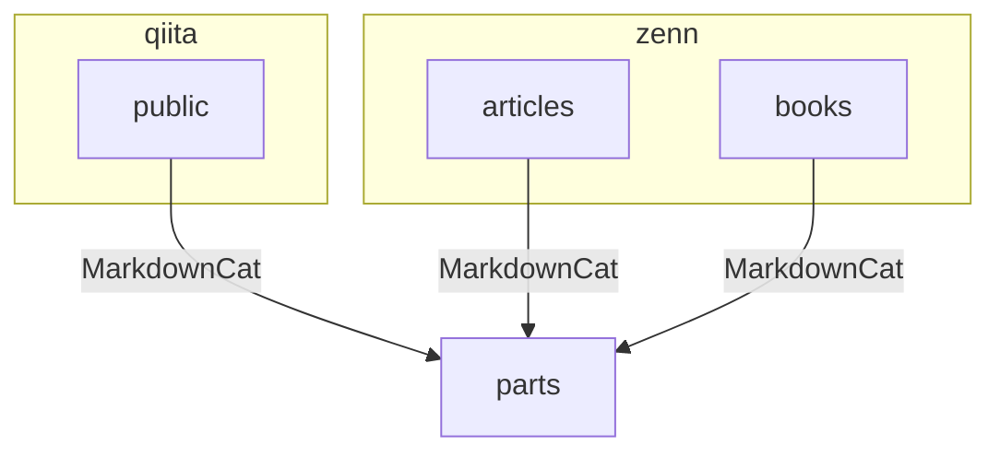

# Articles

## ディレクトリ

- `articles` ： zenn の記事
- `books` ： zenn の本
- `public` ： Qiita の記事
- `obsidian` ： Obsidian のメモ
- `parts` ： `articles` / `books` / `public` から参照される共通の記事

## 拡張機能

### MarkdownCat

記事を再利用するために利用しています。

https://marketplace.visualstudio.com/items?itemName=poyonshot.markdowncat

## 依存関係

## ライセンス

本リポジトリのライセンスは下記です。

- ソースコード： `MIT`
- 画像や文章などのコンテンツ： `CC BY 4.0`

> 詳細は [LICENSE](./LICENSE) を確認してください。
