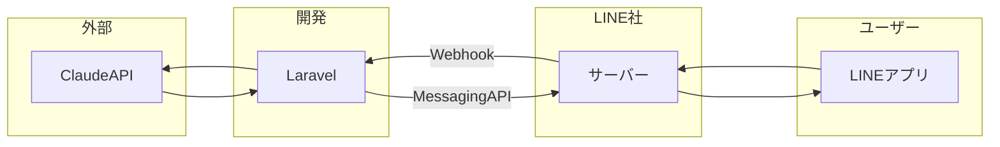
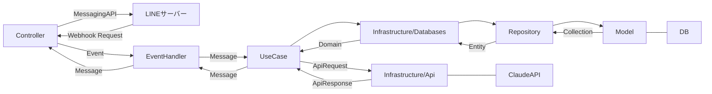

## 1. はじめに

<!-- ../parts/me/introduction-light.md -->
こんにちは。 [@mitsuoka0423](https://twitter.com/mitsuoka0423) です。


この資料は下記イベントのハンズオン資料です。

https://linedevelopercommunity.connpass.com/event/313579/

### 1.1. LINE DC BOT AWARDS 2024

最優秀賞 100 万円の LINE Bot のコンテストが開催されます。

https://lineapiusecase.com/ja/community/linedc-award-2024.html

応募締め切りは 5/7 （火）です！

### 1.2. イベント動画

TODO: イベント後に動画を追加します。


### 1.3. ハンズオンの完成イメージ


### 1.4. インストール

下記を利用するのでインストールしておいてください。

- [Docker Desktop](https://www.docker.com/ja-jp/products/docker-desktop/)
- [devtunnel](https://learn.microsoft.com/ja-jp/azure/developer/dev-tunnels/get-started?tabs=macos)

### 1.5. 事前準備

コンテナの起動に時間がかかるため、先に準備を進めておきます。

1. https://github.com/mitsuoka0423/laravel-line-handson-2024 を clone します。
1. ターミナルでプロジェクトを開き、 `make` を実行します。

`composer install` やコンテナイメージのダウンロードが始まれば OK です。

初回のみファイルを作るかどうか聞かれるので YES を選びます。（そのまま Enter ）


## 2. インプット

### 2.1. LINE Bot

<!-- ../parts/line/introduction.md -->
#### 2.1.1. 企業での事例

- JR 東日本 Chat Bot（[https://info.jreast-chat.com/](https://info.jreast-chat.com/)）
- ヤマト運輸（[https://www.kuronekoyamato.co.jp/ytc/campaign/renkei/LINE/](https://www.kuronekoyamato.co.jp/ytc/campaign/renkei/LINE/)）
- ユニクロ・GU（[http://official-blog.line.me/ja/archives/28533966.html](http://official-blog.line.me/ja/archives/28533966.html)）
- 楽天（[http://official-blog.line.me/ja/archives/24736939.html](http://official-blog.line.me/ja/archives/24736939.html)）など

#### 2.1.2. 行政での事例

https://linecorp.com/ja/csr/activity/government

### 2.2. LINE Bot の仕組み

LINE Bot は、ユーザーが LINE 公式アカウントに対して送信したメッセージに対し、
Messaging API を介してメッセージや画像などをリプライすることで実装されます。


https://developers.line.biz/ja/docs/messaging-api/overview/

### 2.3. Messaging API

大きく分けて 2 種類の機能があります。

- 応答メッセージ
- プッシュメッセージ

#### 2.3.1. 応答メッセージ

- ユーザーが LINE 公式アカウントに対して送信したメッセージに返信できる
- 無料で利用できる

#### 2.3.2. プッシュメッセージ

- 任意のタイミングでユーザーに送信できるメッセージ
- ユーザーに通知したいとき利用される
- コミュニケーションプランでは、月 200 通まで無料（2024/04 時点）
  - https://www.lycbiz.com/jp/service/line-official-account/plan/


### 2.4. Claude 3 API

https://www.anthropic.com/api

`Haiku` / `Sonnet` / `Opus` の 3 種類のモデルを利用できる。


- `MTok` = 100 万トークン
- 全てのモデルで以下を利用可能
  - [Vision](https://docs.anthropic.com/claude/docs/vision)
  - 20 万トークンのコンテキストウィンドウ

API リファレンスはこちら。

https://docs.anthropic.com/claude/reference/getting-started-with-the-api

### 2.5. Laravel

https://laravel.com/docs/11.x

## 3. システム

### 3.1. バージョン

- PHP 8.2
- Laravel 11.0

### 3.2. システム構成



### 3.3. クラス構成



### 3.4. テーブル定義（マイグレーション）

```php
public function up(): void
{
  Schema::create('business_cards', function (Blueprint $table) {
    $table->id();
    $table->string('name')->nullable(false);
    $table->string('company_name');
    $table->string('post_code');
    $table->string('address');
    $table->string('phone');
    $table->string('fax');
    $table->string('email');
    $table->string('image');
    $table->timestamps();
  });
}
```

### 3.5. ユースケース

- 名刺登録
  - `BusinessCardResistrationUseCase`
- 名刺一覧
  - `BusinessCardListViewUseCase`
- 名刺を見る
  - `BusinessCardDetailViewUseCase`


## 4. ハンズオン

### 4.1. LINE 公式アカウント & Messaging API チャネル

https://developers.line.biz/ja/docs/messaging-api/getting-started/

- 作った LINE 公式アカウントと友達になります。
- チャネルシークレットをコピーします。
- チャネルアクセストークンをコピーします。

### 4.2. Claude API キー取得

https://support.anthropic.com/ja/articles/8114521-claude-api%E3%81%AB%E3%82%A2%E3%82%AF%E3%82%BB%E3%82%B9%E3%81%99%E3%82%8B%E3%81%AB%E3%81%AF%E3%81%A9%E3%81%86%E3%81%99%E3%82%8C%E3%81%B0%E3%81%84%E3%81%84%E3%81%A7%E3%81%99%E3%81%8B

- Claude API キーをコピーします。

### 4.3. ソースコード取得

下記リポジトリのコードを clone します。

https://github.com/mitsuoka0423/laravel-line-handson-2024

### 4.4. コンテナ起動

ターミナルで `make` を実行します。


`laravel.test-1` が起動していることを確認します。

### 4.5. devtunnel でグローバルに公開する

ターミナルで `make tunnel` を実行します。

```bash
$ make tunnel

devtunnel host --port-numbers 20080 --allow-anonymous
Hosting port: 20080
Connect via browser: https://*****-20080.asse.devtunnels.ms
Inspect network activity: https://*****-20080-inspect.asse.devtunnels.ms

Ready to accept connections for tunnel: *****-*****-*****
```

`Connect via browser` に表示される URL をコピーしておきます。

### 4.6. Webhook URL を設定

1. [LINE Developers](https://developers.line.biz/ja/) を開いて、作成した Messaging API チャネルを開きます。
2. Messaging API 設定 > Webhook 設定 > Webhook URL に上記でコピーした URL を貼り付けます。

### 4.7. 環境変数設定

`.env` ファイルが生成されるので、下記の値を設定します。

|項目名|値|備考|
|--|--|--|
|APP_URL|`https://*****-20080.asse.devtunnels.ms`|devtunnelの`Connect via browser`に表示されるURLを設定する|
|LINE_CHANNEL_SECRET|`*****`|[LINE Developers](https://developers.line.biz/ja/) > チャネル基本設定 > チャネルシークレット|
|LINE_CHANNEL_ACCESS_TOKEN|`*****`|[LINE Developers](https://developers.line.biz/ja/) > Messaging API 設定 > チャネルアクセストークン|
|CLAUDE_API_KEY|`sk-*****`|[Anthropic Console > API Keys](https://console.anthropic.com/settings/keys) から発行する|

### 4.8. 動作確認

1. 名刺の写真を撮って、 LINE Bot に送ります。
2. 「名刺一覧」と LINE Bot に送ります。

## 5. 演習問題

1. 「名刺を見る」ユースケースを実装してみましょう。
2. 他の Webhook イベントを利用して機能を実装してみましょう。
   - [Webhookイベントのタイプ](https://developers.line.biz/ja/docs/messaging-api/receiving-messages/#webhook-event-types)
3. 自分が欲しい機能を実装してみましょう。

## 6. おわりに

LINE DC BOT AWARD への応募お待ちしております！

https://lineapiusecase.com/ja/community/linedc-award-2024.html

応募締め切りは 5/7 （火）です！
