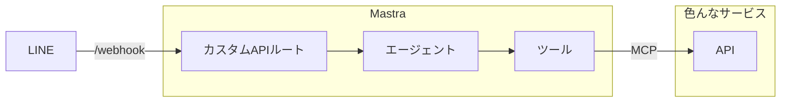

## はじめに

### この記事は？

下記のイベントの解説記事です。

https://linedevelopercommunity.connpass.com/event/363489/

TBU: 動画URL

### 想定読者

- AIエージェントを作ってみたい方
- Mastraに興味がある方

### 事前準備

- Node.js最新版のインストール
- LINE公式アカウント
- GitHubパーソナルアクセストークン
- 使いたいサービスのアクセストークン

## 作るもの

- 色んなサービスにつながって情報を取ってきたり、

## アジェンダ

- Mastraの説明
- LINE(Messaging API)の説明
- `ライブバイブコーディング` LINE Bot実装
- `ライブバイブコーディング` GitHubとつなげる
- いろんなサービスとつなげる(MCPサーバーの探し方)
- (時間があれば)長期記憶を持たせる

## Mastraについて

- TypeScriptエージェントフレームワーク
- AIアプリケーションや機能を構築するために必要なプリミティブを提供するように設計

### プリミティブ

#### エージェント

#### ツール

## LINE Botについて

## サンプルコード
