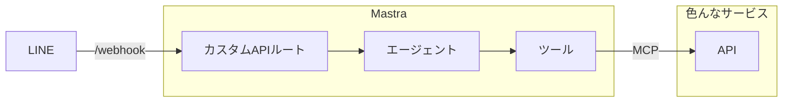
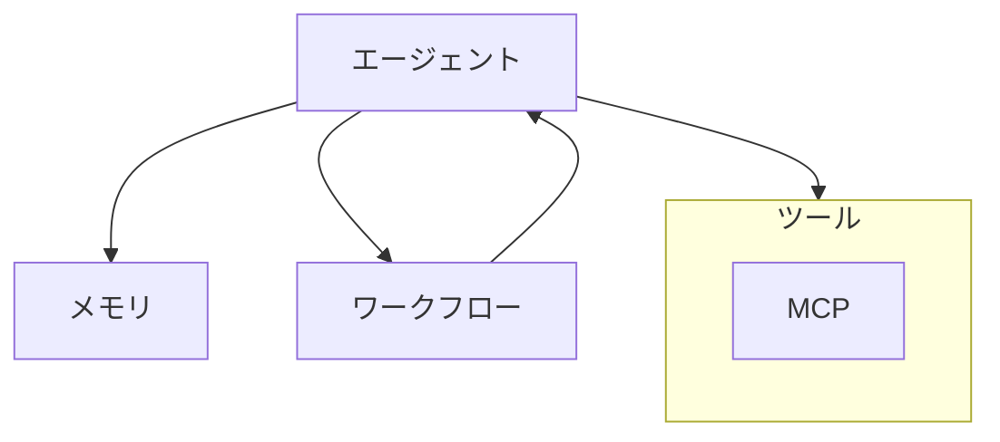

## はじめに

### この記事は？

下記のイベントの解説記事です。

https://linedevelopercommunity.connpass.com/event/363489/

https://github.com/mitsuoka0423/mastra-line-bot

https://www.youtube.com/watch?v=J2JqKIUzRQQ&pp=0gcJCa0JAYcqIYzv

### 想定読者

- AIエージェントを作ってみたい方
- Mastraに興味がある方
- LINE Botに興味がある方

### 事前準備

- Node.js最新版のインストール
- LINE公式アカウント
- GitHubパーソナルアクセストークン
- 使いたいサービスのアクセストークン

## 作るもの

- 色んなサービスにつながって情報を取ってきたり、情報を更新したりできるLINE Bot

> 
>
> GitHubにつないだイメージ

## アジェンダ

- Mastraの説明
- LINE(Messaging API)の説明
- `ライブバイブコーディング` LINE Bot実装
- `ライブバイブコーディング` GitHubとつなげる
- いろんなサービスとつなげる(MCPサーバーの探し方)
- (時間があれば)長期記憶を持たせる

## Mastraについて

- TypeScriptエージェントフレームワーク
- AIアプリケーションや機能を構築するために必要なプリミティブを提供するように設計

### プリミティブ

#### エージェント

- Mastraの中核的なプリミティブの一つ
- エージェントは言語モデルを使用して、一連のアクションを決定する
- 関数(ツール)を呼び出すことができる
- ワークフローと組み合わせることができる

#### ツール

- エージェントが特定のタスクを実行したり外部情報にアクセスしたりするために実行できる関数

#### メモリ

- エージェントが利用可能なコンテキストを管理する方法

#### ワークフロー

- ステップの実行順を制御する方法
- ステップにエージェントの呼び出しを含めることができる

## LINE Botについて

> [Messaging APIの仕組み](https://developers.line.biz/ja/docs/messaging-api/overview/#how-messaging-api-works)

を見ながら説明します。

## ライブバイブコーディング

### LINE Bot実装

- イベントでデモします。

### GitHubとつなげる

- イベントでデモします。

## いろんなサービスとつなげる(MCPサーバーの探し方)

> [MCPサーバーの使い方](https://zenn.dev/tmitsuoka0423/books/mcp-handson-guide) > MCPサーバーの探し方

を見ながら説明します。

## (時間があれば)長期記憶を持たせる

- イベントでデモします。（ぶっつけ本番なのでうまく動かないかも）
