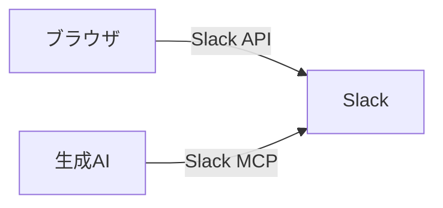
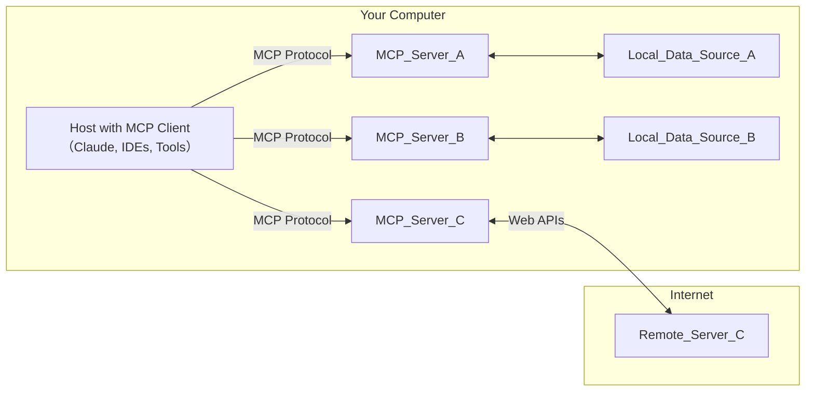
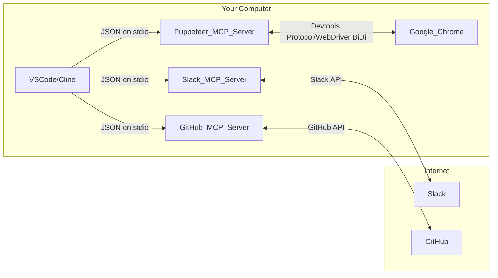
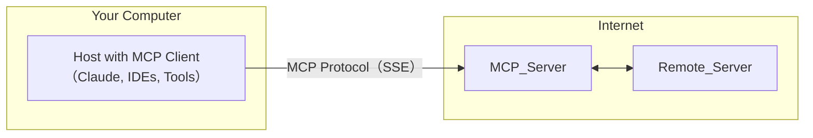
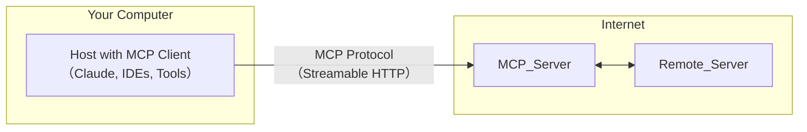

## Model Context Protocol

- `MCP` = `Model Context Protocol`
- LLMにコンテキスト（文脈）を提供する方法を標準化するプロトコル
- Anthoropicが主導して策定

## 利用する側面から見たMCP

- Webで言うところのいわゆる`API`と同じ立ち位置のイメージ
- 生成AIから色んなサービスにアクセスする際にMCPが利用できる

## アーキテクチャ

### 公式の図

> [Introduction - Model Context Protocol](https://modelcontextprotocol.io/introduction)

### 具体化

### リモートMCP

#### 2024/11/05の仕様

> [Specification - Model Context Protocol](https://modelcontextprotocol.io/specification/2024-11-05)

#### 2025/03/26の仕様

> [Specification - Model Context Protocol](https://modelcontextprotocol.io/specification/2025-03-26)

## 参考リンク

- [モデルコンテキストプロトコル（MCP） - Anthropic](https://docs.anthropic.com/ja/docs/agents-and-tools/mcp)
- [MCPに入門する/ Introduction to MCP - Speaker Deck](https://speakerdeck.com/shuntaka/introduction-to-mcp)
- [MCP入門](https://zenn.dev/mkj/articles/0ed4d02ef3439c)
- [Transports - Model Context Protocol](https://modelcontextprotocol.io/specification/2025-03-26/basic/transports)
